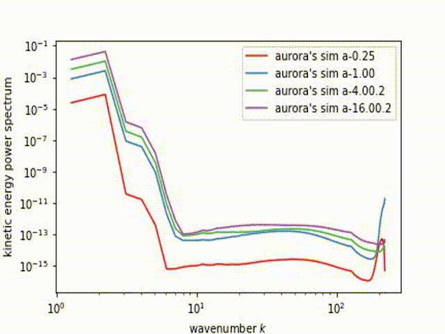

## Understanding Energy Transfer in Plasma Turbulence

Welcome to my virtual gallery! 
Please enjoy these fun visualizations that illustrate what's happening in plasma turbulence simulations

<iframe width="560" height="315" src="https://www.youtube.com/embed/U0Cxs1h-4Dc" frameborder="0" allow="autoplay; encrypted-media; gyroscope; picture-in-picture" allowfullscreen></iframe>

### **Turbulence is Beautiful**

  

<iframe width="560" height="315" src="https://www.youtube.com/embed/U0Cxs1h-4Dc" frameborder="0" allow="autoplay; encrypted-media; gyroscope; picture-in-picture" allowfullscreen></iframe>

*Plasma turbulence* is irregular motion of plasma fluids. It plays an important role in star formation, galaxy formation, and other interesting phenomena, but **turbulence is not well understood.**

**Large scale computer simulations** allow us to *visualize* turbulence and *analyze* what is happening.

Another attempt:

  <iframe width="560" height="315" src="https://www.youtube.com/embed/U0Cxs1h-4Dc" frameborder="0" allow="autoplay; encrypted-media; gyroscope; picture-in-picture" allowfullscreen></iframe>

### What do these visuals show?

To simulate plasma turbulence, we computationally simulate stirring fluid inside a 3D box. The **forcing amplitude** tells us how quickly we spin the stir sticks. Varying the forcing amplitude allows us to simulate turbulent systems with **different levels of compressibility** (different sonic Mach numbers). Our simulations have Mach numbers of Ms=0.4, Ms=0.8, Ms=1.6, Ms=2.9, and Ms=5.6. 
 
These animatations illustrate *density, velocity, acceleration, and cell-centered magnetic field magnitudes*. They allow us to visualize how these features change over the course of the simulation (start at Turb.0001, end at Turb.0100). 

Remember: **these are sliceplots**, so they are only giving us a two dimensional view of what is really a 3D simulation. Most of the sliceplots shown here are oriented perpendicular to the x axis, but we could just as easily have chosen to look from the y or z direction.

## Hydrodynamic simulations

These visuals come from hydrodynamic situations. They show plasma turbulence with no magenetic fields present.

#### Density

  

*Noteable features*: notice that all these visuals have their own colorscale. This is because there is significantly more variation in the density of simulations with high forcing amplitudes than in those with low forcing amplitudes. Using independent scales for each simulation allows us to detect the turbulence present in all of them, rather than only those with large forcing amplitudes.

In the last three panels, we see shock waves developing. This indicates that the sonic Mach number is greater than or equal to 1 (the speed of the average particle is greater than the speed of sound).

#### Velocity

### Magnetohydrodynamic (MHD) Simulations
These visuals illustrate plasma turbulence in the presence of magnetic fields. The streamlines here illustrate the magnetic field lines in the two directions perpendicular to the viewing direction. I've also changed the colorscheme so it's easier to see the streamlines. Notice how the features of these simulations seem to be shaped by the magnetic field lines.

#### Density

### Velocity

### Acceleration

### Cell-centered magnetic field magnitudes

### Power Spectra

## Acknowledgements
We run our plasma turbulence simulations using Athena, which was developed at Princeton (https://github.com/PrincetonUniversity/Athena-Cversion)

## Image experimentation

